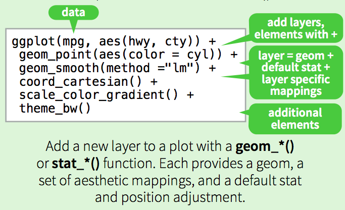

###Preps
Please install and load the following packages first

```
install.packages("tidyverse")
install.packages("ggmap")
require(tidyverse)
require(ggmap)
```

```{r setup, include = FALSE}
knitr::opts_chunk$set(echo = TRUE, tidy = TRUE, warning = F)

require(tidyverse)
require(ggmap)
```

##Why? 
* Versatility and flexibility
* It just looks better

##ggplot
###1. The basics
####From base R plot function to ggplot  

```{r}
head(mtcars)
```  

```{r}
plot(mtcars$wt, mtcars$mpg)
```  

```{r}
qplot(data = mtcars, wt, mpg, geom = "point")
# Note that this would also work without "geom"
```

```{r}
ggplot(data = mtcars, aes(x = wt, y = mpg)) + geom_point()
```


####Practice 1
* Generate a dataframe dfnorm with two standard normal distributions called var1 and var2 with n = 1000 (set seed to 1)
* Create a scatterplot with ggplot  

```{r, echo = F}
set.seed(1)
dfnorm <- data.frame(var1 = rnorm(1000), var2 = rnorm(1000))
ggplot(dfnorm, aes(var1, var2)) + geom_point()
```

```
set.seed(1)
dfnorm <- data.frame(var1 = rnorm(1000), var2 = rnorm(1000))
ggplot(dfnorm, aes(var1, var2)) + geom_point()
```

####ggplot syntax
A good breakdown from the [**ggplot cheat sheet**](https://www.rstudio.com/wp-content/uploads/2015/03/ggplot2-cheatsheet.pdf).  


####Let's add more to the plot!
```{r}
p1 <- ggplot(mtcars, aes(wt, mpg, col = factor(cyl)))
p1 <- p1 + geom_point(shape = 24, size = 2, alpha = 0.6)
p1 <- p1 + geom_smooth(method = "lm", se = F, linetype = "dashed")
p1 <- p1 + scale_color_manual(values = c("8" = "red", "6" = "green", "4" = "blue"), guide = guide_legend(title = "Cylinders"))
p1 <- p1 + ggtitle(label = "MPG vs. Weight")
p1 <- p1 + xlab(label = "Weight") + ylab(label = "Miles Per Gallon (MPG)")
p1 <- p1 + theme_bw()
p1
```

####Practice 2
* Use cyl (remember to convert to factor) and mpg for the boxplot
* Add points and set the size of the points to 2 and the transparency to 0.5
* Set color to engine configuration (vs)
* Use theme_bw() for theme

```{r, echo = F}
p2 <- ggplot(mtcars, aes(factor(cyl), mpg))
p2 <- p2 + geom_boxplot()
p2 <- p2 + geom_point(aes(col = factor(vs)), size = 2, alpha = 0.5)
p2 <- p2 + theme_bw()

p2
```

```
p2 <- ggplot(mtcars, aes(factor(cyl), mpg))
p2 <- p2 + geom_boxplot()
p2 <- p2 + geom_point(aes(col = factor(vs)), size = 2, alpha = 0.5)
p2 <- p2 + theme_bw()

p2
```

###2. ggplot components
####i. Aesthetics
Aesthetics would vary depending on the geom of the plot (eg. linetype for lines), but most plots would have x, y, color, fill, alpha, group, size, label, and shape. Other than x and y, all other aesthetics could be called either inside aes() or outside depending on whether you want the visual specification to map to a specific variable or to the entire dataset.  

* Discussion: What do these plots look like?
```
ggplot(data = mtcars, aes(x = wt, y = mpg, col = factor(cyl), fill = factor(cyl))) + geom_point()
ggplot(data = mtcars, aes(x = wt, y = mpg)) + geom_point(aes(col = factor(cyl), fill = factor(cyl)))
ggplot(data = mtcars, aes(x = wt, y = mpg)) + geom_point(col = "red", fill = "red")
ggplot(data = mtcars, aes(x = wt, y = mpg), col = "red", fill = "red") + geom_point()
```

```{r, echo = F}
ggplot(mtcars, aes(x = wt, y = mpg, col = factor(cyl), fill = factor(cyl))) + geom_point()
ggplot(mtcars, aes(x = wt, y = mpg)) + geom_point(col = "red", fill = "red")
```


Use different aesthetics to represent more dimensions (but don't overkill!).
```{r}
ggplot(mtcars, aes(x = wt, y = mpg, col = factor(cyl), fill = factor(cyl))) + geom_point(aes(shape = factor(vs), size = 2*(hp)/mean(hp)))
```

There are aesthetics that are unique to certain geoms (e.g. map_id for geom_map, ymin and ymax for geom_boxplot). 

####ii. Geoms
Geoms are the most essential layer of ggplot objects. There are a variety of geoms to select from: histogram, bar, point, jitter, line, text, boxplot, violin, density, density2d, polygon, path, map, etc.  

Here's an example of geom_map.
```{r}
usmap <- map_data("state")

p3 <- ggplot() + geom_map(data = usmap, map = usmap, aes(x = long, y = lat, map_id = region), fill = "#ffffff", color = "darkgreen", alpha = 0.5)
p3 <- p3 + theme_void()

p3
```

####iii. Stats
Stats are used when plotting the transformation of a dataset. 

Here's how to create a density plot. 
```{r}
set.seed(1)
rn <- data.frame(Normal.dist = rnorm(400))

p4 <- ggplot(rn, aes(x = Normal.dist))
p4 <- p4 + geom_histogram(aes(y = stat(density)), binwidth = 0.4, col = "black", fill = "#FFFFFF")
p4 <- p4 + geom_density(alpha = 0.3, fill = "#FF6666") + theme_bw()

p4
```
In general, you can map a transformation of a variable (instead of the variable itself) to an aesthetic by using the stat function. 

This also works in 2D. 
```{r}
set.seed(10)
df1 <- data.frame(x = rbeta(1000, 1, 3), y = rbeta(1000, 1, 3))

p5 <- ggplot(df1, aes(x, y)) + geom_point(size = 0.3)

# Option 1
p5 + stat_density2d(aes(col = ..level..))

# Option 2
p5 + stat_density2d(aes(fill = ..density..), geom = "raster", contour = F)

# Option 3
p5 + stat_density2d(aes(fill = ..density..), geom = "tile", contour = F)
```

A couple things to note:  
* Many of the stat functions are roughly equivalent to geom functions. For example, stat_smooth and geom_smooth can be used interchangeably. The only exception is when you want to use a non-standard geom (stat_smooth has a geom = "smooth" default option which can be modified)  
* you can either use stat(density) or ..density.. for aesthetics

####iv. Scales
Scales help you adjust the visualization of the aesthetics (color, fill, axes, etc.).  
Back to the 2d density plot
```{r}
p6 <- p5 + stat_density2d(aes(fill = ..density..), geom = "raster", contour = F)
p6 <- p6 + scale_fill_distiller(palette = "Spectral", direction = -1)
p6 <- p6 + theme_void()

p6
```

####Practice 3
* Create a 2d density plot with dfnorm
* Use "tile" as geom (contour = F) and "RdYlGn" for color palette

```{r, echo = F}
ggplot(dfnorm, aes(var1, var2)) + stat_density2d(aes(fill = ..density..), geom = "tile", contour = F) + scale_fill_distiller(palette = "RdYlGn", direction = -1) + theme_void()
```

```
ggplot(dfnorm, aes(var1, var2)) + stat_density2d(aes(fill = ..density..), geom = "tile", contour = F) + scale_fill_distiller(palette = "RdYlGn", direction = -1) + theme_void()
```

Going back to the US map.
```{r}
crimes <- data.frame(region = tolower(rownames(USArrests)), USArrests)
head(crimes)

p7 <- p3 + geom_map(data = crimes, aes(fill = UrbanPop, map_id = region), map = usmap)
p7 <- p7 + scale_fill_viridis_c(alpha = 0.5, begin = 0.5, end = 1, direction = -1)

p7
```

####Practice 4
* Use cyl (remember to convert to factor) and mpg for the boxplot
* Add points and set the size of the points to 2 and the transparency to 0.5
* Color the points by engine configuration (vs, blue for V and red for Straight)
* Color the box with "lightgreen" and set transparency to 0.1
* Use theme_bw() for theme
* Bonus: recreate the legend

```{r, echo = F}
p8 <- ggplot(mtcars, aes(factor(cyl), mpg))
p8 <- p8 + geom_point(aes(col = factor(vs)), size = 2, alpha = 0.5)
p8 <- p8 + geom_boxplot(alpha = 0.1, col = "lightgreen")
p8 <- p8 + xlab(label = "Cylinder") + ylab(label = "Miles Per Gallon (MPG)")
p8 <- p8 + scale_color_manual(values = c("1" = "red", "0" = "blue"), labels = c("V", "Straight"), guide = guide_legend(title = str_wrap("Engine Configuration", width = 12)))
p8 <- p8 + theme_bw()

p8
```

```
p8 <- ggplot(mtcars, aes(factor(cyl), mpg))
p8 <- p8 + geom_point(aes(col = factor(vs)), size = 2, alpha = 0.5)
p8 <- p8 + geom_boxplot(alpha = 0.1, col = "lightgreen")
p8 <- p8 + xlab(label = "Cylinder") + ylab(label = "Miles Per Gallon (MPG)")
p8 <- p8 + scale_color_manual(values = c("1" = "red", "0" = "blue"), labels = c("V", "Straight"), guide = guide_legend(title = str_wrap("Engine Configuration", width = 12)))
p8 <- p8 + theme_bw()

p8
``` 

You could also apply log and sqrt transformation to the axes (scale_x_log10()). There are also options to reverse or extend the axes, and to change x to a time series axis.

####v. Position
You can also adjust positions of the aesthetics. This could mean jittering a scatter plot or creating stacked bar plots.
```{r}
p9 <- ggplot(mtcars, aes(factor(cyl), mpg))
p9 <- p9 + geom_point(aes(col = factor(vs)), size = 2, alpha = 0.5, position = "jitter")
p9 <- p9 + geom_boxplot(alpha = 0.1, col = "lightgreen")
p9 <- p9 + xlab(label = "Cylinder") + ylab(label = "Miles Per Gallon (MPG)")
p9 <- p9 + scale_color_manual(values = c("1" = "red", "0" = "blue"), labels = c("V", "Straight"), guide = guide_legend(title = str_wrap("Engine Configuration", width = 12)))
p9 <- p9 + theme_bw()

p9
```

```
p9 <- ggplot(mtcars, aes(factor(cyl), mpg))
p9 <- p9 + geom_point(aes(col = factor(vs)), size = 2, alpha = 0.5, position = "jitter")
p9 <- p9 + geom_boxplot(alpha = 0.1, col = "lightgreen")
p9 <- p9 + xlab(label = "Cylinder") + ylab(label = "Miles Per Gallon (MPG)")
p9 <- p9 + scale_color_manual(values = c("1" = "red", "0" = "blue"), labels = c("V", "Straight"), guide = guide_legend(title = str_wrap("Engine Configuration", width = 12)))
p9 <- p9 + theme_bw()

p9
```  

There are a few other ways to achieve this.  

```
geom_point(position = "jitter")
geom_point(position = position_jitter())
geom_jitter()
```
####Practice 5
* Recreate the following plot
* Use the same color scheme as the previous boxplot
* Use "dogde" position to create the side-by-side bar plot
* Use theme_classic()

```{r, echo = F}
p10 <- ggplot(mtcars, aes(x = factor(cyl)))
p10 <- p10 + geom_bar(aes(y = ..count.., fill = factor(vs)), position = "dodge", alpha = 0.5)
p10 <- p10 + scale_fill_manual(values = c("1" = "red", "0" = "blue"), labels = c("V", "Straight"), guide = guide_legend(title = str_wrap("Engine Configuration", width = 12)))
p10 <- p10 + xlab(label = "Cylinders")
p10 <- p10 + theme_classic()

p10
```

```
p10 <- ggplot(mtcars, aes(x = factor(cyl)))
p10 <- p10 + geom_bar(aes(y = ..count.., fill = factor(vs)), position = "dodge", alpha = 0.5)
p10 <- p10 + scale_fill_manual(values = c("1" = "red", "0" = "blue"), labels = c("V", "Straight"), guide = guide_legend(title = str_wrap("Engine Configuration", width = 12)))
p10 <- p10 + xlab(label = "Cylinders")
p10 <- p10 + theme_classic()

p10
```

####vi. Theme
All the themes we've used so far are default themes. You can create your own theme from scrath or make modifications to a default theme.  

Here's an example of setting a new theme
```{r}
yourtheme <- theme_bw() + theme(panel.background = element_rect(fill = "yellow"))
p10 + yourtheme
```

####vii. Facets
Create subplots based on discrete variables.  

Recall the scatter plot from mtcars: 
```{r}
p11 <- ggplot(mtcars, aes(wt, mpg, col = factor(cyl)))
p11 <- p11 + geom_point(aes(shape = factor(vs)), size = 2, alpha = 0.6)
p11 <- p11 + scale_color_manual(values = c("8" = "red", "6" = "green", "4" = "blue"), guide = guide_legend(title = "Cylinders"))
p11 <- p11 + ggtitle(label = "MPG vs. Weight")
p11 <- p11 + xlab(label = "Weight") + ylab(label = "Miles Per Gallon (MPG)")
p11 <- p11 + theme_bw()
p11
```

Now if we add a facet layer to "separate" the points by color: 
```{r}
p11 + facet_wrap(~ factor(cyl))
```

Or we can apply a layered facet to "separate" both by color and by shape:
```{r}
p11 + facet_grid(factor(vs) ~ factor(cyl))
```

####viii. Other Adjustments
You can also make other adjustments to your plots, almost everything within the plot is modifiable. From changing the coordinate system (for radar plots) to adding arrows and annotations, ggplot is extremely flexible and Google is often your best friend to get it done. 

To summarize, create a ggplot object follows these steps:  
1. ggplot() call to create your "canvas" along with dataset and aesthetics
2. create geoms and aesthetics associated with each geom
3. adjust visual elements with scale_XX_XXX
4. create title, improve axes labels and legends
5. Other additional adjustments and apply themes

####Practice 6
```{r, include = FALSE}
require(gapminder)
require(gganimate)
require(plotly)
```

We are going to use the [gapminder](https://www.gapminder.org/tools/) dataset and try to re-create of the plots.  

```
install.packages("gapminder")
require(gapminder)
```

```{r}
head(gapminder)
```

* create a plot with Life Expectancy vs. GDP per capita
* include population as size (include show.legend = F, alpha = 0.6)
* use subplots by continent 
* scale fill with values = country_colors
* scale x axis to logarithm of GDP

```{r, echo = F}
ggplot(gapminder, aes(x = gdpPercap, y = lifeExp, size = pop)) +
  geom_point(aes(fill = country), shape = 21, show.legend = F, alpha = 0.6) +
  scale_size_area(max_size = 30) +
  scale_x_log10(limits = c(150, 120000)) + ylim(c(20, 90)) + 
  scale_fill_manual(values = country_colors, aesthetics = c("colour", "fill")) +
  facet_wrap(~ continent) +
  theme_bw()
```

```
ggplot(gapminder, aes(x = gdpPercap, y = lifeExp, size = pop)) +
  geom_point(aes(fill = country), shape = 21, show.legend = F, alpha = 0.6) +
  scale_size_area(max_size = 30) +
  scale_x_log10(limits = c(150, 120000)) + ylim(c(20, 90)) + 
  scale_fill_manual(values = country_colors, aesthetics = c("colour", "fill")) +
  facet_wrap(~ continent) +
  theme_bw()
```

##tidyverse
The entire process of manipulating datasets and creating visualization could be streamlined with tidyverse (dplyr, tidyR, ggplot). 
```{r}
p12 <- gapminder %>% filter(year == 1977) %>% ggplot(aes(gdpPercap, lifeExp)) + 
  geom_point(aes(fill = continent, size = pop), shape = 21, show.legend = F, alpha = 0.6) + 
  scale_size_area(max_size = 30) + 
  scale_x_log10(limits = c(150, 120000)) + ylim(c(20, 90)) + 
  scale_fill_manual(values = continent_colors, aesthetics = c("colour", "fill")) +
  theme_bw()

p12 <- p12 + geom_text(data = gapminder %>% filter(year == 1977, pop >= 1e8), aes(label = country), size = 5, check_overlap = T, show.legend = F)

p12
```

##gganimate
[gganimate](https://github.com/thomasp85/gganimate) is a great tool for animation but not super straightforward.  

```
install.packages("gganimate")
require(gganimate)
```

```{r}
p13 <- ggplot(gapminder, aes(x = gdpPercap, y = lifeExp, size = pop)) +
  geom_point(aes(fill = country), shape = 21, show.legend = F, alpha = 0.6) +
  scale_size_area(max_size = 30) +
  scale_x_log10(limits = c(150, 120000)) + ylim(c(20, 90)) + 
  scale_fill_manual(values = country_colors, aesthetics = c("colour", "fill")) +
  facet_wrap(~ continent) +
  theme_bw() +
  # Now comes gganimate
  labs(title = 'Year: {floor(frame_time)}', x = 'Logarithm of GDP per capita', y = 'Life Expectancy') +
  transition_time(year) +
  ease_aes('linear')

animate(p13, nframes = 96)
```

##[Plotly](https://plot.ly/)
Plotly is even more interactive than gganimate and works well with ggplot.  
```
install.packages("plotly")
require(plotly)
```

```{r}
p14 <- ggplot(gapminder, aes(x = gdpPercap, y = lifeExp, size = pop, fill = continent, frame = year)) + 
  geom_point(shape = 21, show.legend = F, alpha = 0.6) + 
  scale_size_area(max_size = 20) + 
  scale_x_log10(limits = c(150, 120000)) + ylim(c(20, 90)) + 
  scale_fill_manual(values = continent_colors) +
  facet_wrap(~ continent) +
  theme_bw()

plty1 <- ggplotly(p14, height = 600, width = 800) %>%
  animation_opts(frame = 500,
                 transition = 500, 
                 easing = "linear",
                 redraw = FALSE)
plty1
```
